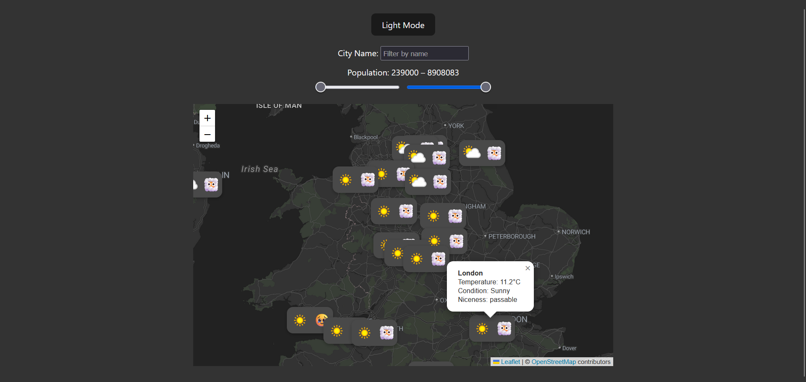

# Weather Map web application

This web application was made as a final assignment for Modern Web Application course **@MIMUW**. The app fetches the city and weather data for a region displayed on a map and then loads it on form of the markers. It's made with React and Redux.



The project was made using *Vite* template.


### `.env` file

The app fetches weather data using [WeatherAPI](https://www.weatherapi.com/). You need to provide your API key for the data to be properly fetched. The key should be placed in `.env` file in following format.

```
VITE_WEATHER_API_KEY="YOUR_API_KEY"
````

## How to run

The app is launched using npm. Simply navigate to the project folder and run:

```
npm install
npm run dev
```

